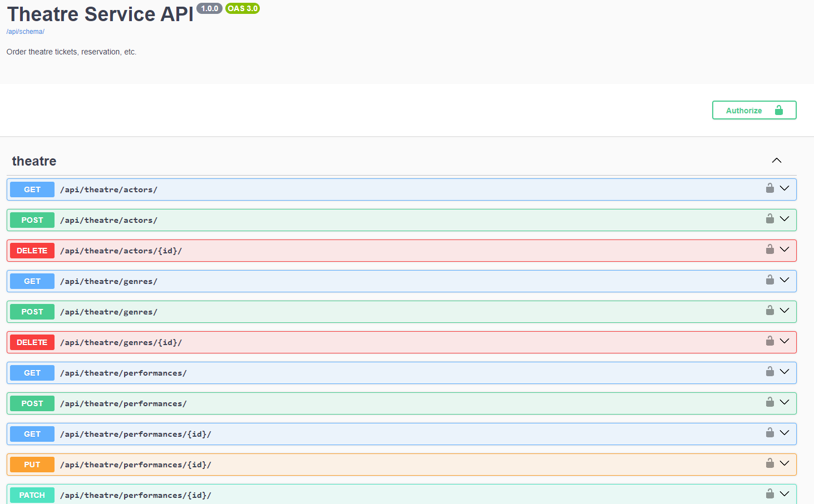

# theatre-drf
This is the Theatre Management API. This project provides a comprehensive set of endpoints to manage the entire theatre ecosystem.

## Features
- JWT token authentication.
- Swagger documentation.
- Throttling for Anon, Auth users.
- API Pagination.
- Image uploading.
- Theatre API has many endpoints api/theatre: actors, genres, plays, performances, theatre_halls, reservations.
- User API has multiple useful endpoints you can check them at swagger documentation page.
- Use endpoints to buy tickets, check reservation history any many more.
- For endpoints you can check the swagger documentation api/schema/swagger/.


## Common installation

1. **Clone the repository:**

   ```sh
   git clone https://github.com/panicua/theatre-drf.git (After develop branch merged with main)
   cd theatre-drf
   ```

2. Create and activate **venv** (bash):
   ```sh
   python -m venv venv
   source venv/Scripts/activate
   ```
   Windows (Command Prompt)
   ```sh
   python -m venv venv
   venv\Scripts\activate
   ```
   Mac / Linux (Unix like systems)
   ```sh
   python3 -m venv venv
   source venv/bin/activate
   ```

### Local installation:
1. Install **requirements.txt** to your **venv**:
   ```sh
   pip install -r requirements.txt
   ```

2. Create a `.env` file in the root of the project directory. You can use the `.env.example` file as a template (just change DJANGO_SECRET_KEY):
    ```sh
    cp .env.example .env
    ```
   - **IMPORTANT.** Make sure USE_POSTGRES=False in .env

3. Create apply migrations:
   ```sh
   python manage.py migrate
   ```

4. (Optional) use my sample of prefilled DB:
   ```sh
   python manage.py loaddata preloaded_db.json
   ```
   
5. Start the server:
   ```sh
   python manage.py runserver
   ```
   
### Docker local installation:
1. Create app image and start it:
   ```sh
   docker-compose build
   docker-compose up
   ```
2. (Optional) use my sample of prefilled DB:
   ```sh
   docker-compose exec theatre_app python manage.py loaddata preloaded_db.json
   ```

### If you used prefilled database from .json:
   - **admin_user**. email: admin@admin.com, password: admin
   - **auth_user**. email: test@test.com, password: testtest


## DEMO:

